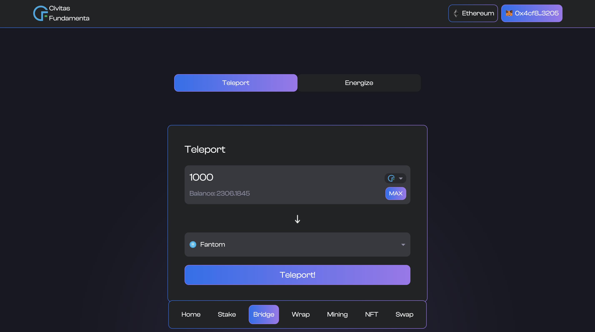
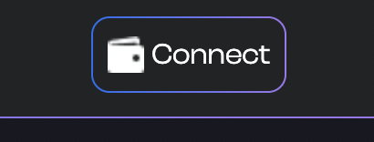
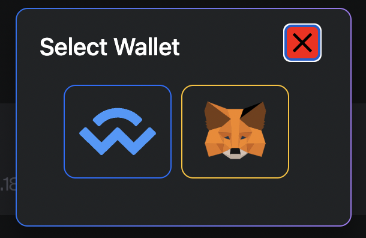
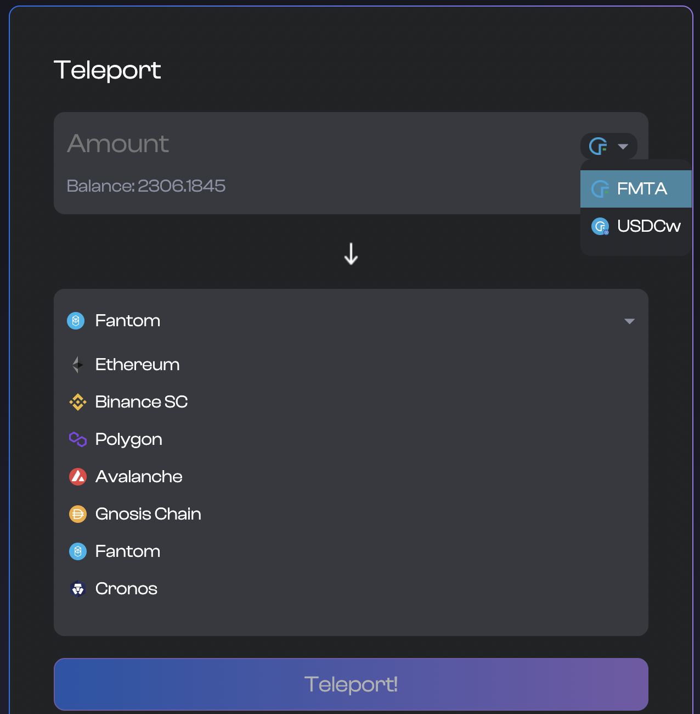
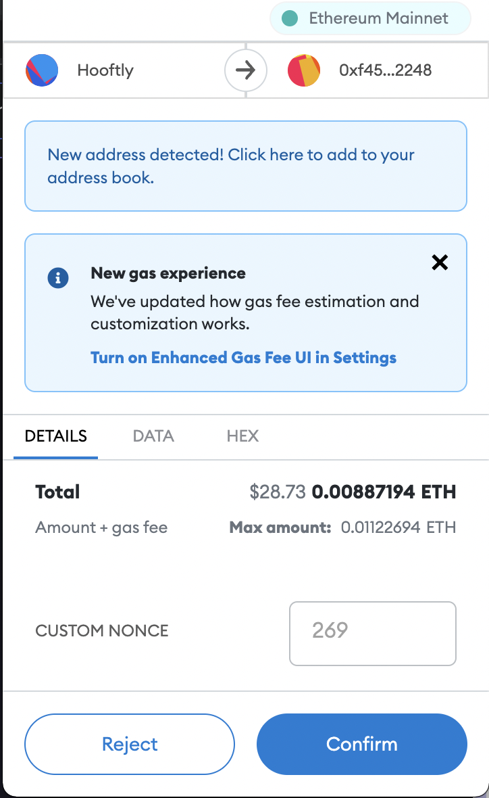
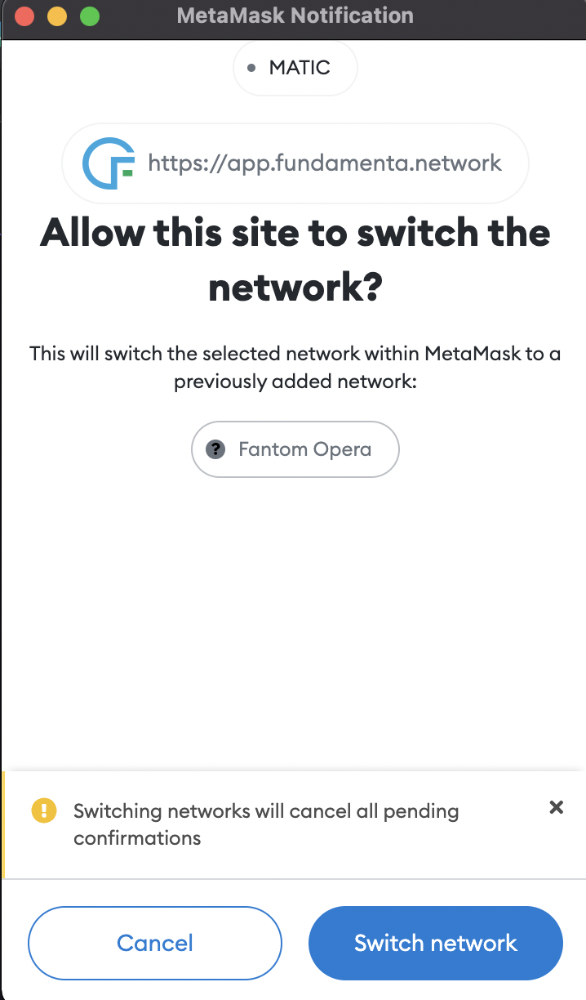
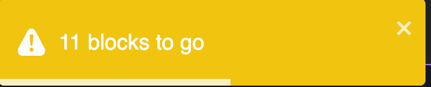
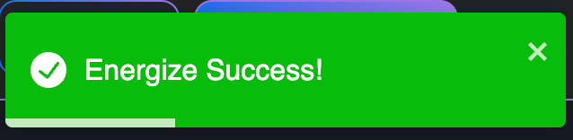
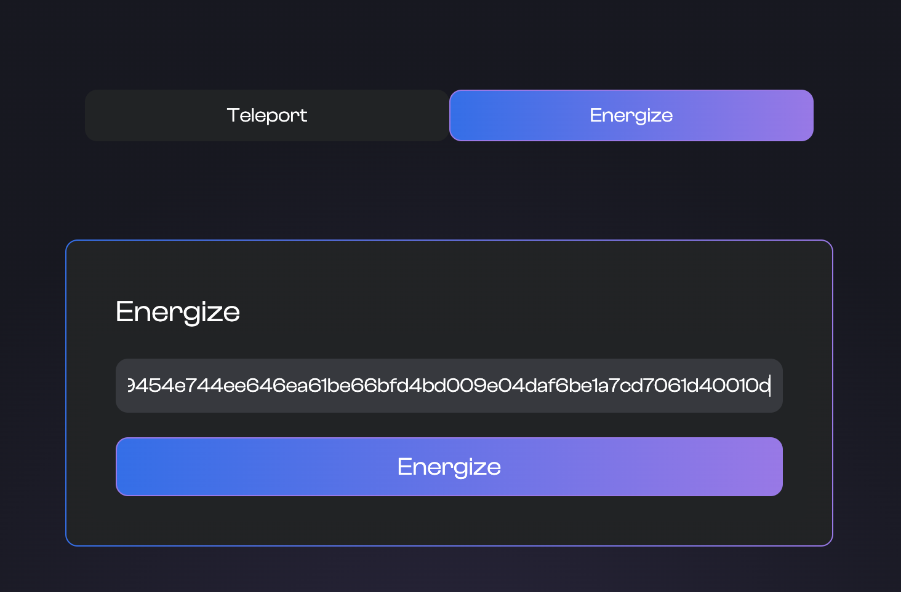

# Teleport tokens between blockchains using Civitas Fundamenta's bridge CiviPort

Using our bridge users can Move FMTA and others from one blockchain to another.  When you move tokens between blockchains the token is "Dematerialized" or burned on the originating blockchain and is then "Energized" or minted on the destination blockchain. 

Our bridge like all our other offerings are available on our Mobile App as well as our Dapp but things are much more of a seamless experience from our app so we highly reccomend it. NFA

The purpose of this part of the guide is to guide you through the teleportation process on both platforms.

## How to Teleport using the Fundamenta Mobile App

This section is about using our bridge via our easy to use mobile application.  It is MUCH simpler of a process than with the Dapp and we reccomend newer users take advatage of this. To use the bridge via the app with a compatible token all you need to to is select it from your balance screen.  Make sure you select the network you want to teleport from. If the token is CiviPort compatible the option `TELEPORT` will be available for selection along with `TRANSFER` and `SWAP`.  I think you can guess what is next but just in case you don't we will show you.

{: style="width:350px;display: block; margin: 0 auto"}

### Initiating a teleport

Now that you are where you need to be to initiate a teleport you are only a few short steps away from being a multi-chain master. First you need to select the network you wish to teleport your coins too. Click where you see `Select Network` and a modal will appear where you can choose one of our 7 supported networks. After selecting the destination you just need to enter the amount you wish to teleport.  Click Teleport and watch the magic happen!

{: style="width:350px;display: block; margin: 0 auto"}

### Energizing a teleport

With Fundamenta Mobile you have the option of energizing teleports yourself or having the app attempt to do that for you automatically. You can configure this in the settings section available by clicking the gear icon in the top right corner. In either case the end result is the same. That being said... For the sake of this tutorial we will operate with automatic teleport energizing off. The only difference?  You need to click something. Yup thats it.  

Now to buissness. Once the teleport has been initiated and the first part of the transaction is complete we need to navigate to the teleports screen.  You can do this by clicking the second icon from the right on the bottom navbar. Once there you will see your teleport at the top of the list (if its not your first one) with the status `Queued`.  All you need to do to energize the teleport on the destination is click it.  Once clicked it will contact the validator swarm.  There is a minimum amount of blocks that need to be created before a teleport can be imitiated.  If there is still some time remaining the app will let you know.  In this case we just need to wait.  Once the app contacts the swarm again and is able to achieve concensus with the other swarm nodes our all so familiar gas and transaction confirmation prompt will appear and ask if you want to energize.  Select yes and we are of to the races.  Switch to the transaction history page which is the icon directly to the left of the teleport one you are currently on to watch it finish.  Once complete you have successfully traversed blockchains and can freely use those tokens as you please.  And just becasue we all like to watch things here it is all in action.

{: style="width:350px;display: block; margin: 0 auto"}

And thats it! Within a few clicks you can traverse chains with ease all from the comfort of the toilet or... you know wherever you use your mobile device the most.

___
___

## How to teleport FMTA using the Dapp

### Connect

First we need to make sure we are connected to the dapp with our wallet by clicking the connect button in the top right of the interface.

{: style="display: block; margin: 0 auto"}

If on Desktop you will be given the choice to use Metamask's browser extension or Wallet Connect to connect.

{: style="height:width:300px;display: block; margin: 0 auto"}

### Select Token and Network

Next we need to select the token we wish to teleport and the network we wish to energize it on.

### Time to teleport

Once the token and network have ben selected enter the amount you wish to move across chains and click teleport!  Once you have done this if using Metamask a confirmation will pop up asking to confirm the teleport.   

{: style="width:350px;display: block; margin: 0 auto"}

Once confirmed and the transaction has processed the Dapp should automatically prompt you to switch networks to the destination blockchain.

{: style="width:350px;display: block; margin: 0 auto"}

After switching networks the Dapp should automatically prompt you with another Metamask confirmation to allow the tokens to be energized on the destination blockchain.  In some cases some more confirmations may be required before the tokens can be energized.  In this case you will see a warning telling you how many more blocks there are to go before the teleport can be energized.

{: style="display: block; margin: 0 auto"}

After the required blocks have passed the dapp should automatically prompt you to energize and accept the transaction.  If all is well you will see an alert telling you it has been successful.

{: style="display: block; margin: 0 auto"}

### Troubleshooting with the Teleports

Multichain programs are fun but as fun as they are they are also complicated due to having to communicate with mutliple networks in a secure and useful fashion.  Ideally your teleports with the Dapp will always automagically prompt you where it needs to while using CiviPort but there may be a reson this is not the case.  Wheter it be network connectivity, a wrongly clicked button or just bad luck you my need to manually energize a teleport once in a while.  Not to worry though because this is very easily done!

### Energizing Manually

There is an app (or option at least) for that!  You may have noticed on the Bridge page that there are two options.  Teleport and Energize.  We have already gone over what Teleport does and is used for and as you have guessed, Energize will help you energize your teleport if for some reason you ever have to manually.

The first thing you need to do is obtain the transaction hash or "TXID" of the transaction on the blockchain that the teleport was initiated on. Refer to your wallets history to find this as it should be the very last transaction you sent. NOTE: Make sure you are connected the originating network with your wallet as this is required.  Once you have the TXID you simply just need to plug that into the energize tab and click "energize"!

Once this is complete the network switch prompt (like shown above) will pop up and ask you to switch to the destination network and then the comfirmation for the pending teleport will appear.  Confrim and your teleport is complete.

Of course if you need any further assitance please feel free to come ask for help in either our [Telegram](https://t.me/CivitasFundamenta) or [Discord](https://discord.gg/S7daQmW) communities where someone is always around to help.
