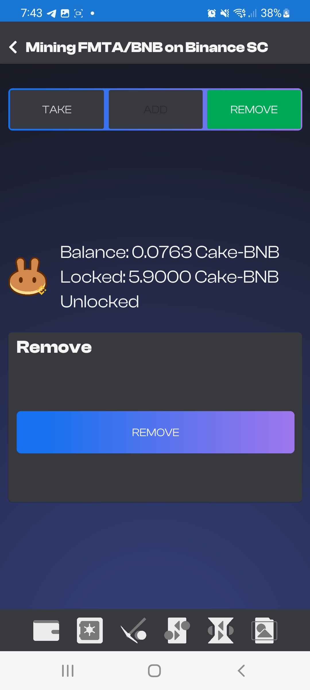
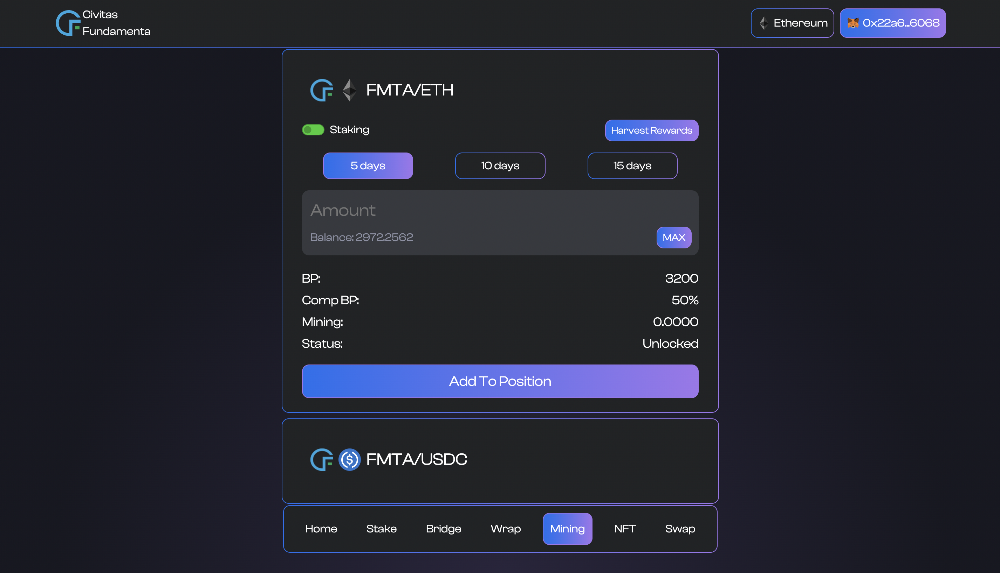
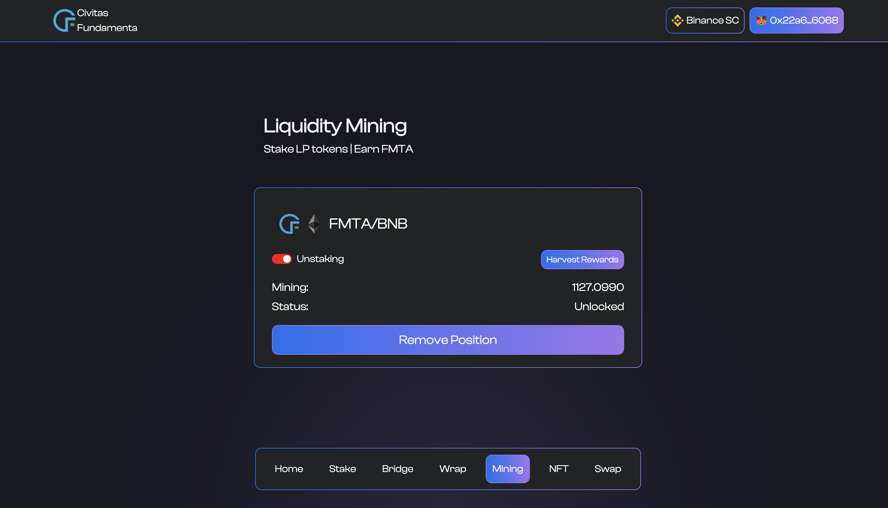

# Liquidity Mining Program 

Civitas Fundamenta has allocated 10 million FMTA of the current 50 million supply cap to be emitted through liquidity mining programs.  Currently we are offering the program on 3 pools across 2 chains (Ethereum and Binance Smart Chain). This guide will explain the process of liquidity mining through the mobile application and Dapp. More programs may be added in the future.

**NOTE:** This guide assumes you have already added liquidty to one one of the participating pools and are holding the require LP tokens to utilize the liquidity mining program. 

## Liquidity mining with the mobile application

### Adding required LP Tokens and enabling mining
To access liquidity mining on the mobile application you first and foremost must hold participating pools LP Tokens in your wallet and make sure they have been imported.  If your tokens have not been added to the mobile app via the `ADD TOKEN` option liquidity mining will not be available to you.  

Navigate to the `ADD TOKEN` Screen by clicking the double coin stack icon on the top right of the balnces screen. Once there you have the ability to manually ad the tokens information yourself but for convenience we have added a default token list which you can choose from to make the process of adding certain tokens quick and easy.  CLick the menu icon on the bottom right beside `IMPRORT` to being up the default list.  Pick the LP token of your choice and the information will populate and you can then click `IMPORT`.  This will add the liqidity token pair to your balances and then make the option to liquidity mine available in the app.

{: style="display: block; margin: 0 auto"}

### Placing a new position

Once you have added your LP tokens to your balances and enabled liquidity mining adding a new position is easy.  All you need to do is navigate to the pair on the liquidity mining page you wish to add a position for and select the ad tab. This will bring up the amount input box and lock period selection. You have the choice of 5, 10 or 15 day lock periods with longer lock periods offering higher rewards and bonuses.  Rewards and bonuses are out of scope of this tutorial and are explained elsewhere.  Choose the amount of LP tokens you wish to add to your position, select the lock period and click add.  That's it!  You can now monitor your position from the liqudity mining tab and it will tell you when you position is unlocked. 

{: style="display: block; margin: 0 auto"}

### Managing your position once it's placed

It is up to you to manage your position once it has been placed.  Don't worry this isn't complicated it just requires action on your part once the lock period has completed so you can earn your rewards and continue your position or remove it.  At the end of the lock period you will have 3 options. You will be able to choose to Remove your entire position (which will withdraw your rewards with the LP tokens automaticlly), Take your rewards AND add more LP Tokens to your position increasing your rewards for the next period, or you can choose to take your rewards and relock your position for the same lock period you chose prior.  Both the options adding LP tokens and taking rewards and relocking add to your positions basis points.  This will be explained further in another tutorial along with the rewards system.

### Adding to an existing position

Adding to an existing position may not quite be where you think. To Add to an existing position once its unlocked navigate to the `TAKE` tab on the LP Token pairs mining screen.   Enter the amount you wish to add into the input box and click `TAKE`.  The LP Tokens will be added to your position and locked for the same lock period chosen prior, your rewards from the last lock period will be distributed and your rewards expected at the end of the lock period will have increased with your position.

### Taking rewards and relcoking

Taking your rewards and relocking is the same exact process as adding to an existing position minus a step.  All you have to do is leave the add input field which is labled "optional" blank and click the `TAKE` button.  Your rewards will be distributed and position will be relocked for the period chosen prior. 

### Removing your position

If you wish to remove LP tokesn you can once your lock period has ended.  You are only able to remove the entire position.  Once removed all bonus basis points earned will be gone and your rewards will be distributed.  Removal is as easy as pressing a button when the position is unlocked.  Once unlocked navigate to the LP token pairs Mining page `REMOVE`tab and click the remove button.  You LP Tokens will be removed from the mining contract anf returned to your wallet and your rewards will be distributed.

{: style="width: 350px;display: block; margin: 0 auto"}

## Liquidity mining with the Dapp online

Mining with the dapp follows the same concept as the mobile app but the flow is a bit different.  Navigate to the [swap page](https://app.fundamenta.network/#/swap) and you will see pool options (or no options) depending on the network you are connected to.  Click on the pair you wish to interact with and you will see the following screen.

{: stytle="display: block; margin: 0 auto"}

### Adding a new position

Adding a new position is pretty straight forward.  First you must choose one of the 3 available lock periods of 5, 10 or 15 days.  Once selected enter the amount of LP tokens you wish to mine with or use the max button to mine them all.  One the amount is entered all you have to do is click `Add To Position` and follow the transaction prompts from metamask.  **NOTE:**If this is the first time you are interacting with the liquidity mining contracts pool pair you will need to confirm an approval first.  Once approved and the transaction is confrimed your position will be placed and the LP tokens will be moved to the liquidity mining contract. 

### Harvesting rewards

To harvest your rewards you will need wait until your position is unlocked.  Once it has reached this state you can find the `Harvest Rewards` buttton on the top right of both the add and remove parts of the card.  Harevesting rewards will distribute the lock periods rewards and relock your current position with the lock period chosen prior.  

### Harvesting rewards and adding to an existing position

When your lock period is complete you will have the option to keep your basis points and grow them.  This will be explained in another tutorial.  This can be done by either withdrawing your rewards via the previous described step or you have the option to add more LP tokens to your position at the end of the lock period without sacrificing any bonuses.  To to this when the position has become unlocked add to your position like you did [originally](#adding-a-new-position).  This will add the chosen LP Token amount to your position, harvest your rewards and grow your basis points. 

### Removing a position

A position can not be partially removed so if you wish to remove LP tokens the whole position must be removed.  **IMPORTANT NOTE:** If you harvest rewards your lock period will be reset and you will not be able to remove your position. **Rewards are automatically harvested when your position is removed**

On the top left of the pool pair mining card you will see a slider toggle labled `Staking`.  If you click this slider it will then read `Unstaking` and bring you to the position removal card seen below.

{: stytle="display: block; margin: 0 auto"}

Once here all we need to do is ensure our position is unlocked and click the `Remove Position` button.  The transaction confirmation will pop up, confirm it and your LP tokens along with your rewards will be sent to your wallet.

