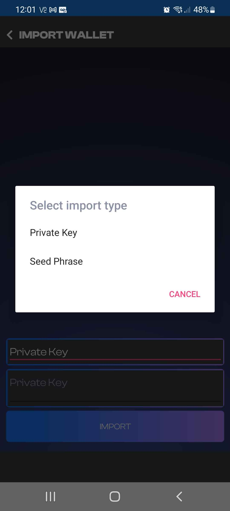
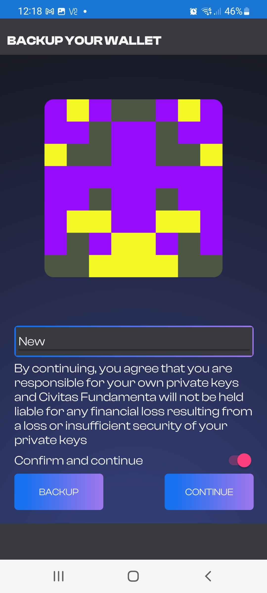
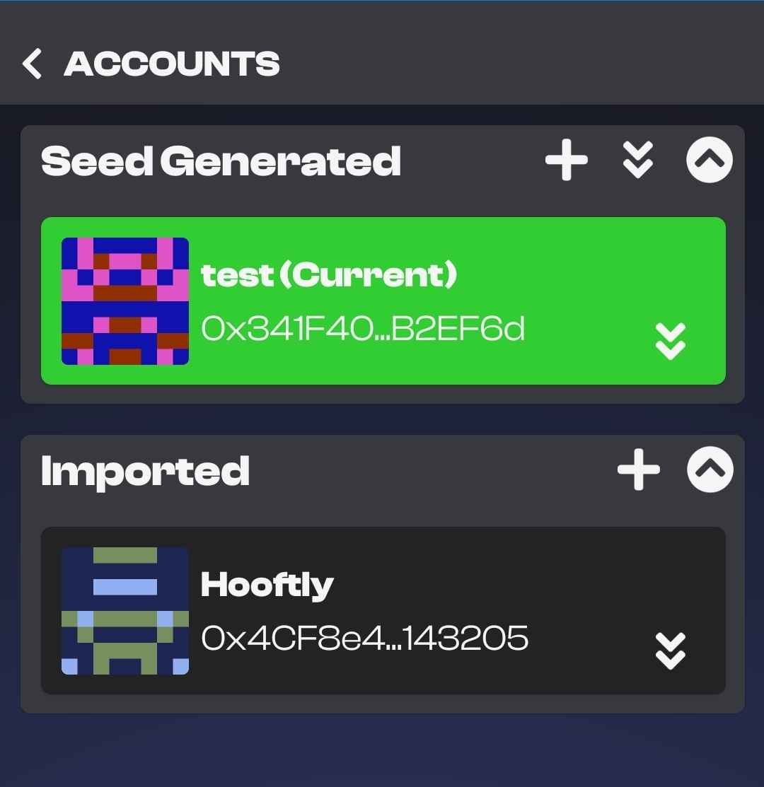

# Getting setup with the Fundamenta Mobile App

If you are here you are looking to get up and going with our multi-chain DeFi capable wallet.  It is designed from the ground up with multi-chain users as its focus.  It currently supports 7 networks and the best part is you can se and manage all these assets without any network configurations!  Let's get started its super easy!

## Opening the application for the first time

Upon the first time you open the application you will be presented with a Terms of Service screen. 

{: style="width:350px;display: block; margin: 0 auto"}

Nobody likes terms and conditions but this is something that can't be avoided.  We collect absolutely zero data so there is no data mining.  Please read the terms and then hit the accept button to continue.

## Pin setup

This part is pretty self explanitory but we will explain it anyways.  Now you must create 6 digit Pin before creation or restoration of a wallet.  Enter it once and then enter it again for confirmation.

{: style="width:350px;display: block; margin: 0 auto"}

## Options to create a wallet

After choosing a pin you will then be brought to the "Create a wallet" Screen.  You will be given three choices.  `NEW WALLET`, `IMPORT SEED/PRIVATE KEY` or `SCAN A CIVIPORT WALLET QR`

{: style="width:350px;display: block; margin: 0 auto"}

### New Wallet

This is absolutely the simplest way to get started and create a new wallet.  See the example below of just how easy!

{: style="width:350px;display: block; margin: 0 auto"}

After accepting the terms and conditions nd creating a pin if you do not require importing an old wallet all you need to do is click `NEW WALLET`.  It will then take you to another disclaimer that you must accept (WE CANNOT HELP YOU KEEP YOUR WALLET SAFE FROM USER ERROR) and you will then have your fancy new multi-chain Ethereum Virtual Machine compatible wallet ready to explore!  Note that wallets created this way use the MetaMask seed schema.  

### Import Seed or Private Key

When choosing the Seed or Private Key option you will be be brought to an input and selection screen.  This is where you will need to select either the `PRIVATE KEY` or `SEED PHRASE` option.  Please note that Fundamenta Mobile is compatible with MetaMask seed phrases making switching over simple and easy.  

{: style="width:350px;display: block; margin: 0 auto"}

Seed Phrases consist of 12 words and look something like `Juice Tanker Yellow Garage Auto Ready Great Restore Unless Treaty Indigo Wheat`

Private Keys will consist of of 64 Bit Random Hex and look something like `652a97845864a14281e6a28baa6b993fb3c81db6dd3b51303caaf2ebce3d39b6`

Once you have made your choice and entered your seed phrase or private key you will arrive on our final disclaimer.  This one also lets you know that it is you and not Civitas Fundamenta who is resposnsible for proper backup and storage of your seed phrase or private key.

{: style="width:350px;display: block; margin: 0 auto"}

### Scan a CiviPort Wallet QR

Fundamenta Mobile also has the ability to both export and import QR Codes that can be generated in the app.  We will go into detail on how to backup your seed phrase or private keys in a later section.  

Restoring with a QR is real easy.  All you need to do is select `SCAN A CIVIPORT WALLET QR` and accept the permission to allow the app to use your camera.  It will recognize the QR code and load the required info.  If you were smart and used QR encryption you must enter your encryption key before continuing to decrypt your QR. Once decrypted you will be brought to our backup disclaimer screen.  Give your wallet a name, select the slider to acknowledge the discliamer and you are all done!

{: style="width:350px;display: block; margin: 0 auto"}

___
___

## Backing up your wallets

The first thing you should do after creating a new wallet is back it up.  It cannot be stressed enough that without your recovery phrase, private keys or backup QR code you cannot restore your wallets funds in the case of a lost device or data loss/corruption.  This is the only way to ensure continued accesss to your funds.  

### SECURITY NOTE: 
It is imperitive that you take the security and storage of your seed phrase/private keys seriously. Aside from the fact that if they are misplaced or dmamged you could lose access to your funds,  there is also the possibility of an attacker obtaining your seed phrase/private keys and if stored unencrypted you could be at a total loss.

## Backup Procedure

Wallet management in Fundamenta Mobile happens all in one place. To get to the account management screen go ahead and click the Blockie or address on the top of the applications screen shown below.

{: style="width:350px;display: block; margin: 0 auto"}

Once you have entered the Accounts management screen you will be presented with two types of address schema that Fundamenta Mobile supports.  `Seed Generated` or `Imported`.  Now remember if you chose to create a new wallet with the app and not import one your address will be seed generated. Likewise if you were to import a seed from MetaMask it would also be located under the seed generated option.  If you were to import a private key only (which are avaialbe for every ethereum address in existence) it would appear under the Imported option.

It is the same procedure for either option to backup.  On the account managment screen simply choose the double arrow down in any of the areas to reveal either the wallets seed phrase or accounts private keys.

{: style="width:350px;display: block; margin: 0 auto"}

### Important Note
Seed Generated addressess and all those created after are what is called `deterministic`.  The long and the skinny of this is the first address is derived from the seed as is each address after.  This means if you are using the seed genrated wallet option you could create 12 addresses, delete the apps data, restore the wallet with the seed phrase and continue to create another 12 addresses you will find that will all be the same as before.  This is an obvious advantage to using the seed system because it allows you to have a single phrase for back up for an almost infiite amount of wallet/private key pairs.

## CONCLUSION

BACK UP YO DAMN WALLETS