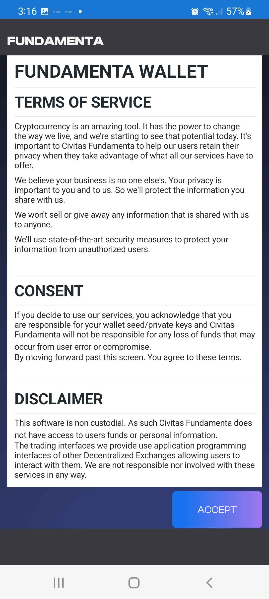
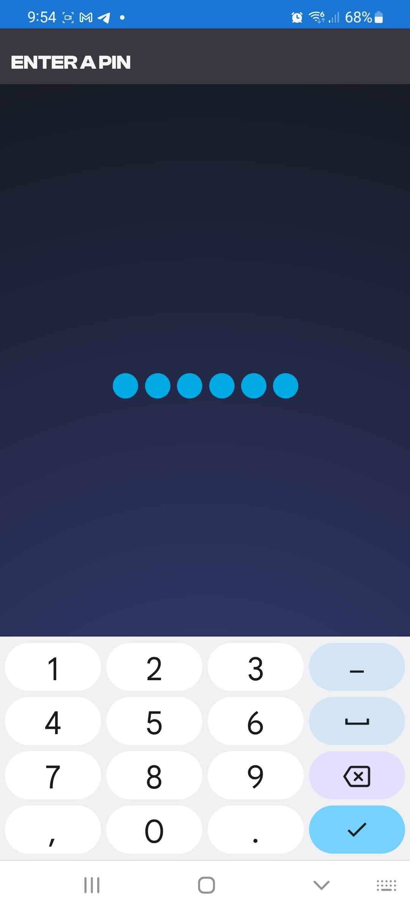
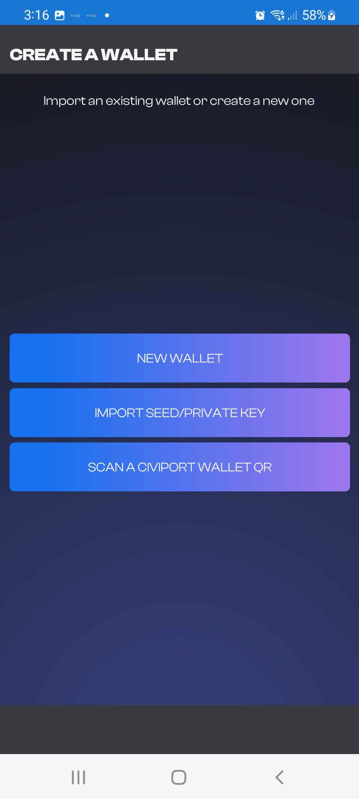

# Getting setup with the Fundamenta Mobile App

If you are here you are looking to get up and going with our multi-chain DeFi capable wallet.  It is designed from the ground up with multi-chain users as its focus.  It currently supports 7 networks and the best part is you can se and manage all these assets without any network configurations!  Let's get started its super easy!

## Opening the application for the first time

Upon the first time you open the application you will be presented with a Terms of Service screen. 

{: style="width:350px;display: block; margin: 0 auto"}

Nobody likes terms and conditions but this is something that can't be avoided.  We collect absolutely zero data so there is no data mining.  Please read the terms and then hit the accept button to continue.

## Pin setup

This part is pretty self explanitory but we will explain it anyways.  Now you must create 6 digit Pin before creation or restoration of a wallet.  Enter it once and then enter it again for confirmation.

{: style="width:350px;display: block; margin: 0 auto"}

## Options to create a wallet

After choosing a pin you will then be brought to the "Create a wallet" Screen.  You will be given three choices.  `NEW WALLET`, `IMPORT SEED/PRIVATE KEY` or `SCAN A CIVIPORT WALLET QR`

{: style="width:350px;display: block; margin: 0 auto"}

### New Wallet

This is absolutely the simplest way to get started and create a new wallet.  See the example below of just how easy!

{: style="width:350px;display: block; margin: 0 auto"}

After accepting the terms and conditions nd creating a pin if you do not require importing an old wallet all you need to do is click `NEW WALLET`.  It will then take you to another disclaimer that you must accept (WE CANNOT HELP YOU KEEP YOUR KEYS) and you will then have your fancy new multi-chain Ethereum Virtual Machine compatible wallet ready to explore!

### Import Seed or Private Key

### Scan a CiviPort Wallet QR