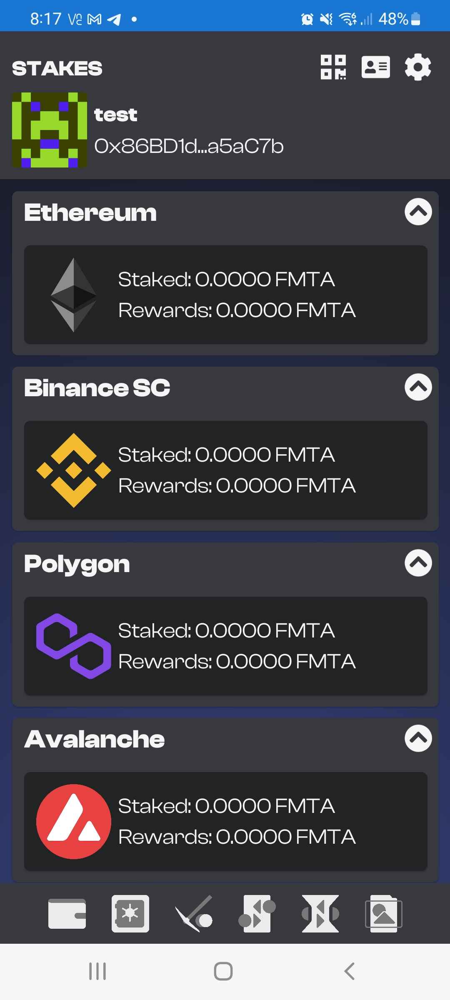
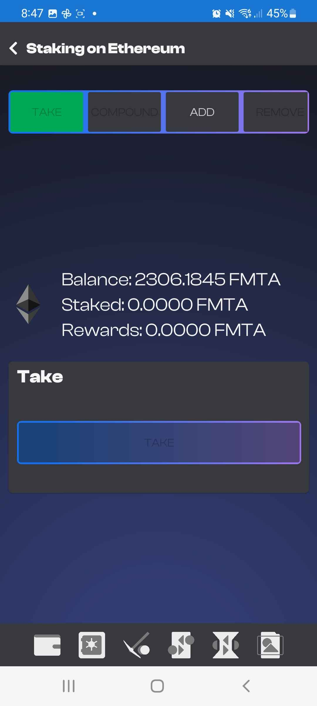
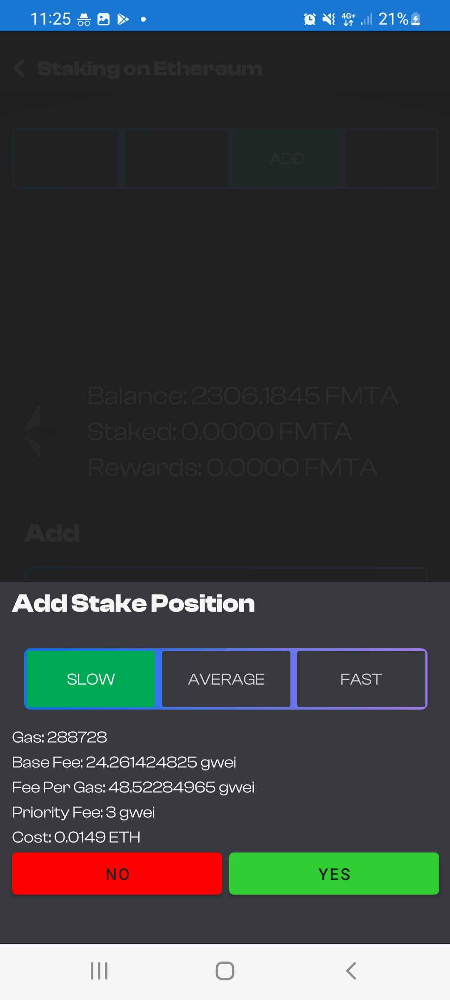
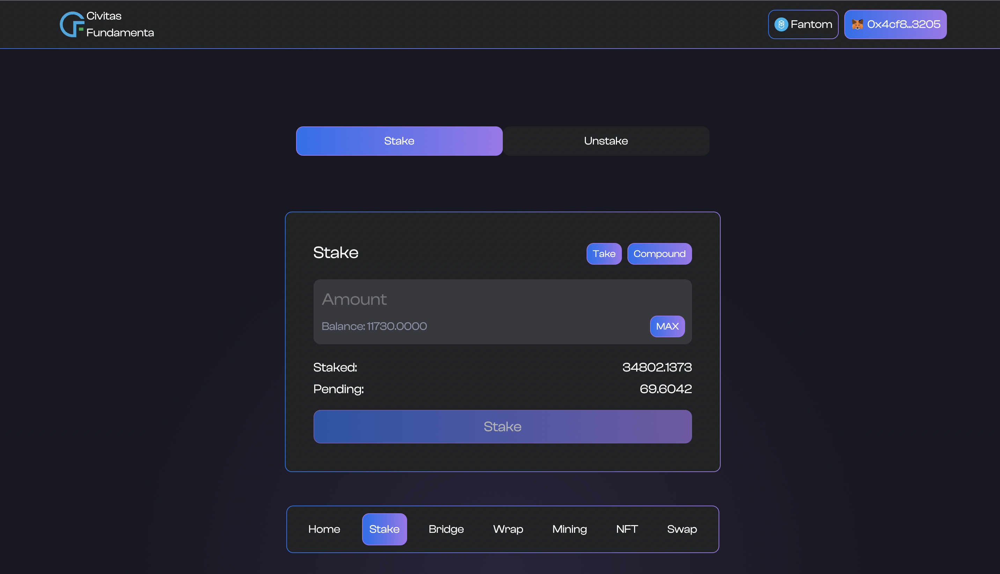
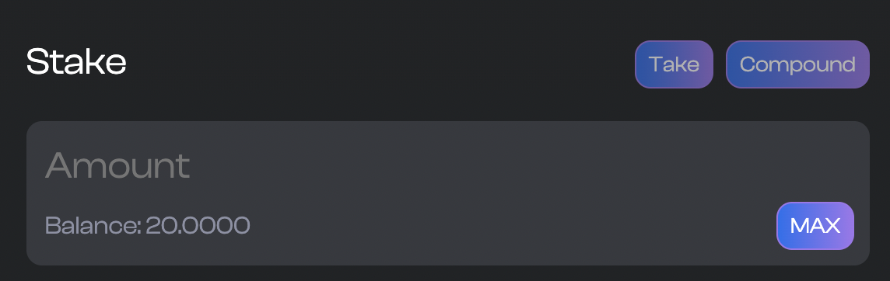

# Staking the Fundamenta Token

Users who hold the Fundamenta token have the ability to choose and stake their tokens to earn daily yield.  The current system allows for a blanket and unchanging APY of 73%.  The formula to calculate your daily rewards is quite simple and is currently set at `Tokens Staked / 500 = Daily Reward`.  Currently single accounts have a cap of how much they can stake.  This makes daily staking emissions predictable.  

Fundamenta staking is available on every single chain we support at the same APY.  Just buy or teleport Fundamenta to the network of your choice and use the Dapp or Mobile app to get staking.

## A FEW WARNINGS

Fundamenta's staking contracts accross networks have a few quirks that you need to be aware of to maximize rewards and make sure you are not locked into a position when you do not want to be.

First and foremost Fundamenta staking has a mandatory 48 Hour Lock Period.  The period activates as soon as you place a position.  48 Hours re determined by the amount of blocks that are supposed to approximately be created in a single day.  For example on Ethereum 6500 Blocks would represent approx 24 Hours.   Because each network has different block time targets this number is different between blockchains.  This also means that it is just an approximation of time and not an exact calculation.  There will be times where your position or rewards unlock slightly before or slightly after the advertised lock period in hours/minutes.

While there is a 48 HR lock after you stake before you can remove your position, your rewards will begin to accrue and be available to withdraw within 24 hrs.  It is possible to `TAKE` or `COMPOUND` your daily rewards every 24 hours but take note that by doing so the 48 hour stake removal lock will be reset.  If you would like for your position to be continuously unlocked yet still accrue rewards this is possible by not taking or compunding pending rewards.  All pending rewards will be automatically withdrawn when your position is removed.  It is not required for you to take or compound before you wish to partially or completely remove your position.  **IF YOU WISH TO REMOVE STAKE AND TAKE OR COMPUND FIRST YOU WILL NEED TO WAIT ANOTHER 48 HOURS**

___
___

## Using the Mobile App to stake

As is a current theme with our products it is by far the easiest to create and manage a staking position from our mobile application.  Within a few clicks you can be earning 73% APY Daily on your Fundamenta Tokens.  To get where you need to be in the app so you get started click the second icon from the left (vault). **NOTE: This guide asumes you are already holding Fundamenta**

{: style="width:350px;display: block; margin: 0 auto"}

Once you arrive on the staking screen choose your desired network and click the card. it will take you to the Fundamenta Staking screen for your selected network.  Here you will be presented with 4 tab selection options `TAKE`, `COMPOUND`, `ADD` and `REMOVE`.  Hopefully these are self explanitory but we will give a brief explanation for each.

* `TAKE` will allow you to withdraw any pending rewards you currently have to your acount

* `COMPOUND` will all you to roll any pending rewards into your current staking position as long as the account is still under the stake cap per account limit.

* `ADD` will allow you to add more Fundamenta to your current staking position. NOTE: you will not be able to add to your position if you have pending rewards.  You must take or compund them first. 

* `REMOVE` will allow you to partially or completely remove your staked position.  Unlike `ADD` you do not need to `TAKE` or `COMPOUND` any pending rewards as these are automatucally withdrawn with your stake.  **NOTE: IF YOU TAKE OR COMPOUND REWARDS YOUR STAKE LOCK PERIOD IS RESET TO 48 HOURS AND YOU WILL NEED TO WAIT BEFORE YOU CAN REMOVE YOUR STAKED FUNDAMENTA.  YOU HAVE BEEN WARNED!!!**

{: style="width:350px;display: block; margin: 0 auto"}

### Adding a new position

If you are a new staker choose the `ADD` select the amount of Fundamenta you want to stake and complete creating a position by clicking add below.  A prompt will appear asking you which gas level you would like to use (Slow, Average, Fast). It will have some information about the fees and give you the option to accept or decline the transaction.

{: style="width:350px;display: block; margin: 0 auto"}

Make sure to check back every day so see your rewards grow every 24 hours.  If you compound daily your position will grow faster. YAY Math!

### Compounding

**Fees Suck**. This is the reality and no one likes paying them.  They most definitely do not enjoy having to pay them twice which is what users would have to do if there was not a way to compound your pending rewards.  In fact V1 of our staking contract did not have a compund function and that was the actual reality.  Thankfully we upgraded shortly after launch to staking V2 with this fancy new compounding ability.  Everyday you will have the ability to compund your pending rewards and because your daily rewards are based on the amount of Fundamenta staked compunding everyday will yield more and more every time you do.  You can compound pending rewards at any time in any amount so long as the amount will not bring your staked position over the configured cap per account currently and 120,000 FMTA.

The process of compunding is quite simple.  Navigate to the Staking screen for the network of your choice, select the `COMPOUND` Tab and click the following button.  The gas selection and transaction confirmation prompt will appear. Select yes and wait for the transaction to comoplete. Once complete if you do not see your pending rewards now as part of your staked position slide the screen down to trigger a refresh and you should now show the new staked balance.

### Adding to an existing position

So you want to add more Fundamenta to your staked position to get even more of those sweet sweet rewards. Good Choice! Well good news you already know how to do this!  Just navigate to the add Tab on the staking screen of the network of your choice and do thew same thing you did while adding the original position.  Just make sure you **DO NOT** have any pending rewards because adding to an existing position while a user has pending rewards is not possible.  If you do have pending rewards simply `TAKE` or `COMPOUND` them and once complete you can freely add to your position so long as it does not bring the account over the stake cap per account.

{: style="width:350px;display: block; margin: 0 auto"}

### Removing all or part of your staked position

So it's time to unstake and do something.  No Problem!  So long as you haven't compounded or taken any pending rewards in the last 48 hours that is.  When placing a new position a lock is activated that lasts approximately 48 hours.  That lock is deactivated after 48 hours and users can remove any amount from their position at will HOWEVER every time you decide to take or compound any pending rewards this stake lock is **REACTIVATED**.  You will then need to wait for the lock to deactivate before you can remove any of your staked position.  Ok great... but what if my position is unlocked and I do have pending rewards? (Spoiler Alert: You Will) Simply remove the amount you wish and all pending rewards will be removed with them.  

As always on mobile this process is a snap. Navigate to the staking page of the network of your choice, select `REMOVE` and enter the amount you wish to remove.  Select the remove button below and wait for the transaction to complete.  You have now removed part or all of your position and any pending rewards if there were any.  NOTE: If you only remove part of your position your stake lock period is reset to 48 hours.

___
___

## Using the Dapp online to stake

### Disclaimer

While we **REALLY REALLY REALLY** want you to use our mobile app for all things Web3 we understand some users just don't do crypto on mobile.  There is also the idea users just like the convenience of both offerings.  So in that spirit we will go over how to stake the Fundamenta Token using the Dapp online.  

First things first **DON'T GET PHISHED!!!** If you go all nemo and connect your wallet to a malicious version claiming to be us getting caught in it's net **WE WILL NOT BE ABLE TO HELP YOU** and you will likely lose for than your FMTA.

Always ensure you are coneccted to our offical url at **[https://app.fundamenta.network](https://app.fundamenta.network)** before connecting or doing anything.

The following tutorial assumes user will be using the MetaMask desktop extension

### Navigate to the staking page

Page navigation for the app is located floating on the bottom.  Select Stake from the Navbar to arrive on the staking page.

{: stytle="width:350px;display: block; margin: 0 auto"}

### Placing a new position

Adding a new position or to an existing one is relatively easy.  As we can see in the above example of the staking page there is an input box that shows our current Fundamenta balance and a `max` button.  Enter the amount you wish or opt to choose the max button.  Once the amount is entered you will be able to click the `Stake` button and place a new position.  

**NOTE:** There is a cap to the amount of tokens a single account can stake. Currently this set at 120,000 FMTA.

Once you click the stake button the all so familiar MetaMask confirmation modal will appear asking you to complete the contract interaction.  Choose yes and once its complete you will have placed a staking position. Congratulations!

### Compounding or taking pending rewards

Compounding is absolutely the best thing to do if your goal is to grow your stake as much as possible.  Rewards accrue for your position every 24 hours and you will have access to either `TAKE` or `COMPOUND` those rewards at any time you like.  Seeing as how these daily rewards are based on your staked balance everytime you compound or add to an existing position making the amount staked rise as will your daily rewards.

Compounding and taking your rewards are done in the same place. To do this we navigate to [staking page](https://app.fundamenta.network/?#/stake) of the Dapp.  Of course make sure you are connected to the proper network. Once there you will find the `TAKE` and `COMPOUND` options on the top right of the staking card on screen.

{: stytle="width:350px;display: block; margin: 0 auto"}

Depending on what you wish to do click on either `TAKE` or `COMPOUND`.  The prompt to confirm the confirmation will come up, confirm it and wait for the transaction to complete.  If you compounded you will now see the rewards as part of your existing position. If you chose to take they will have been added to your wallets balance.

### Adding stake to an existing position

Adding to an existing position is possible as well.  The process is exactly the same as placing a new position with one caveat.  Users cannot have any pending rewards. If a user wants to add to a position and has pending rewards they must `TAKE` or `COMPOUND` those rewards first.  Once that is completed users are free to add to thier position so long as it does not bring the account over the configured stake cap per account.

