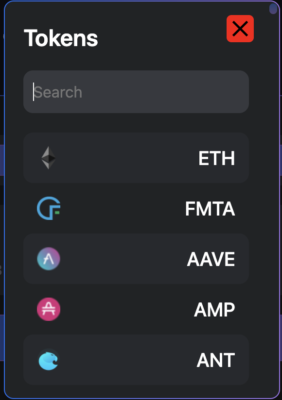

# Swap with ease on Multiple Chains and Dexs with Civitas Fundamenta

Untitled Swap powered by Civitas Fundamenta is a one stop shop to get prices as well as swap decentralized assets available on the networks and exchnages we support.  It is available in our mobile app, on our Dapp and at its own domain untitledswap.com 

## Swap via the Fundamenta Dapp

As mentioned above our Trading engine is availalbe in multiple forms but using the same technology as each other under the hood.  One of this options is accessing swaps directly in our Dapp. Want to buy some Fundamenta to add to your staked position? Do it right in the Dapp!  Just taken pending rewards and looking to turn that into USDC and eventually Fiat?  YES, you can do that too!

The swap interface in the Dapp can be accessed at [https://app.fundamenta.network/#/swap](https://app.fundamenta.network/#/swap) and is compatible with all our supported networks. Our Dapp web version is currently more capable than its mobile cousin because the Dapp swap version has V1 of our aggregator technology already deployed.  At the moment its only connected to a limited amount of DEX's but Rome wasn't built in a day.  When selecting tokens after you have chosen the amount you wish to spend it will search the connected exchanges and display swap info allowing to not only get the best price but also sniff out possible arbitrage opprotunities.  

To swap we need to first select our tokens. When doing so a nice little search modal will pop up with a default token list much like Uniswaps.  if the token you wish to swap is not on the default list you can enter the contract address of your desired token and select it. 

{: style="width:250px;display: block; margin: 0 auto"}

After this is complete it will display a balance of Token A (the first one selected on the left).  Enter the amount of your balance you would wish to spend and click the search button to reveal the available swap options from the connected exchanges complete with info like price impact and minimum amount recieved.  While we realize the vast majority of people will simply buy the best priced option we have left the ability to choose to execute any of the swaps found should you wish. 

All you have to do now is select the option you want and click the Swap on button beside the trade info.  The standard MetaMask confirmation will pop up and ask you to either approve or swap.  Just like every other dex you will need to give this one permission whwen you want to swap a token for the first time. If you have already approved confirm the swap and you are all finished.  

## Swap via the Fundamenta Mobile App

## Swap via the dedicated interface

***Coming Soon ;)***